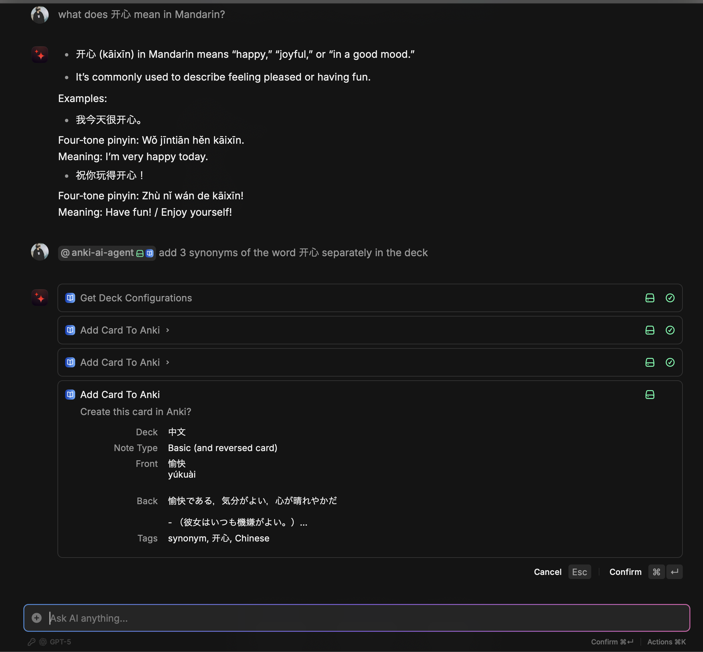
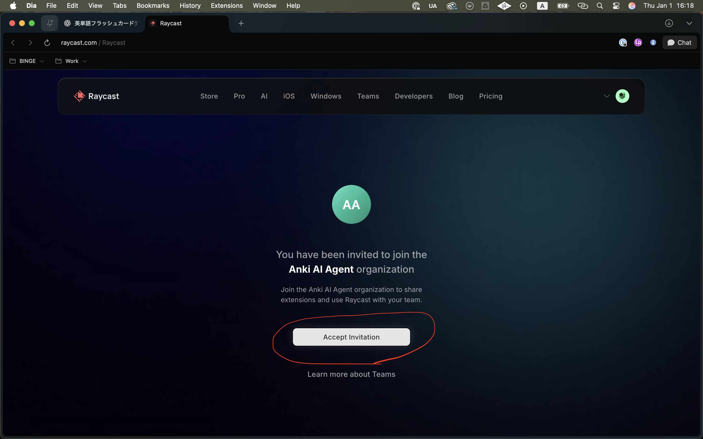
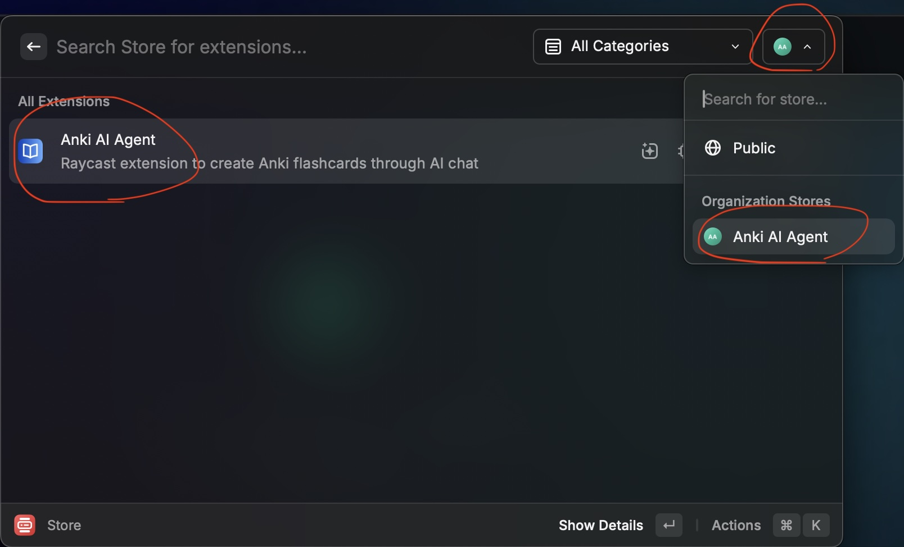

# Anki AI Agent

Create Anki flashcards through natural conversation with AI in Raycast.

- [Anki AI Agent](#anki-ai-agent)
  - [Screenshots](#screenshots)
  - [Installation](#installation)
    - [1. Join the Organization](#1-join-the-organization)
    - [2. Install the Extension](#2-install-the-extension)
  - [Setup](#setup)
    - [1. Install Prerequisites](#1-install-prerequisites)
    - [2. Configure Your Decks](#2-configure-your-decks)
      - [Complete Example: Spanish Vocabulary Deck](#complete-example-spanish-vocabulary-deck)
    - [3. Create Cards](#3-create-cards)
  - [Features](#features)
  - [Export/Import Configurations](#exportimport-configurations)
    - [Export](#export)
    - [Import](#import)

<!-- tocstop -->

## Screenshots




## Installation

This extension is available through the **Anki AI Agent** Raycast organization's private store.

### 1. Join the Organization

Click the invitation link below to join:

**[👉 Join Anki AI Agent Organization](https://www.raycast.com/invite/846fd68b)**

<!-- TODO: スクショを追加 - Organization参加確認画面 -->


### 2. Install the Extension

1. Open Raycast and run the **Store** command
2. Filter by **Anki AI Agent** team (use the dropdown filter)
3. Find "Anki AI Agent" and press `Enter` to install



## Setup

### 1. Install Prerequisites

- **[Anki Desktop](https://apps.ankiweb.net/)** - Must be running while using this extension
- **[AnkiConnect Plugin](https://ankiweb.net/shared/info/2055492159)** - Install in Anki (code: `2055492159`)
- **Raycast AI** - Either [Raycast Pro](https://www.raycast.com/pro) subscription OR set up [BYOK (Bring Your Own Key)](https://manual.raycast.com/ai) with your own API key

### 2. Configure Your Decks

Run **"Configure Anki Decks"** command in Raycast and set up each deck:


#### Complete Example: Spanish Vocabulary Deck

Here's a real example showing how to set up a structured deck for Spanish vocabulary:

**Purpose:**
```
Spanish vocabulary words with multiple example sentences
```

**Front Template:**
```
Spanish Word
[Part of Speech]

Example Sentences:
- Sentence 1
- Sentence 2
```

**Front Example:**
```
hablar
[verb]

Example Sentences:
- Ella habla tres idiomas.
- Necesito hablar contigo.
```

**Back Template:**
```
Meanings:
- Meaning 1
- Meaning 2

Translations:
- (Translation 1)
- (Translation 2)

Notes:
Additional context or usage tips

Related: other related words
```

**Back Example:**
```
Meanings:
- to speak
- to talk

Translations:
- (She speaks three languages.)
- (I need to talk with you.)

Notes:
Regular -ar verb. Commonly used in everyday conversation.

Related: habla (speech), hablante (speaker)
```

This structured approach helps the AI understand exactly how to format your cards. You can use simple or complex templates depending on your needs.

---

When configuring your deck, you'll need to fill in:

**Deck** - Select an existing deck from your Anki collection (e.g., `Japanese::Vocabulary`)

**Note Type** - Choose your card format:
- **Basic** - One-sided card (Front → Back only)
- **Basic (and reversed card)** - Two-sided card (both Front → Back and Back → Front)

**Purpose, Templates, and Examples** - Follow the pattern shown in the example above. The AI uses your templates and examples as formatting guidelines.

### 3. Create Cards

In Raycast AI Chat, mention `@anki-ai-agent`:

```
@anki-ai-agent Add a card: 食べる (taberu) means "to eat"
```

```
@anki-ai-agent Add these Spanish words: casa (house), perro (dog), gato (cat)
```

```
@anki-ai-agent Create a flashcard about the subjunctive mood
```

The AI will:
1. Select the appropriate deck based on your configurations
2. Format the card according to your templates
3. Check for duplicates
4. Ask for confirmation before creating

## Features

- **AI-powered deck selection** - Automatically picks the right deck based on content
- **Smart formatting** - AI follows your template guidelines and examples
- **Markdown support** - Use **bold**, *italic*, `code`, lists in card fields
- **Duplicate detection** - Warns if similar cards already exist
- **Batch operations** - Create multiple cards in one message
- **Confirmation dialogs** - Review before creating each card
- **Export/Import configurations** - Backup and share your deck settings

## Export/Import Configurations

You can export your deck configurations to share with others or back up your settings.

### Export

- **Export all**: In the deck list, select "Export All Configurations" (`Cmd+Shift+E` / `Ctrl+Shift+E`)
- **Export single**: In the edit form, select "Export This Configuration" (`Cmd+E` / `Ctrl+E`)

The configuration is copied to your clipboard as JSON.

### Import

- **Import all**: In the deck list, select "Import Configurations" (`Cmd+Shift+I` / `Ctrl+Shift+I`)
- **Import single**: In the edit form, select "Import Configuration" (`Cmd+I` / `Ctrl+I`)

Paste your JSON configuration, then run the import. Existing configurations with the same deck ID will be overwritten.
